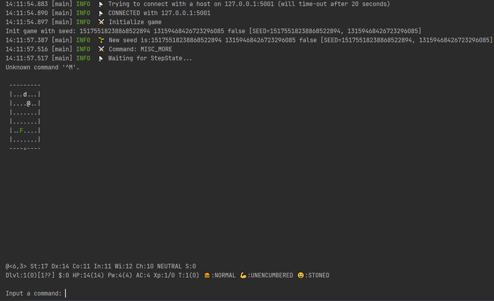
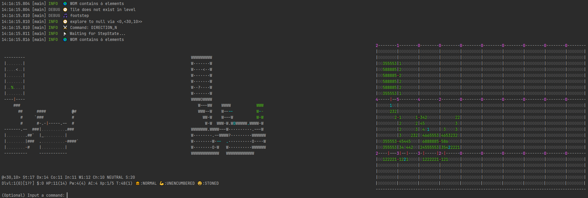
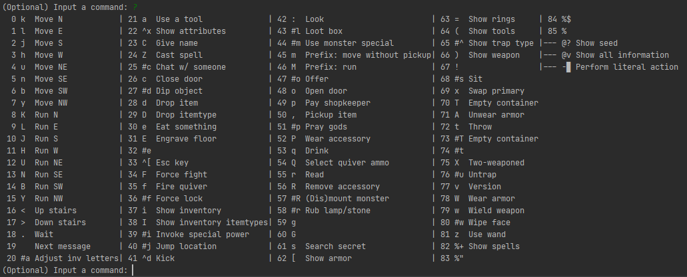
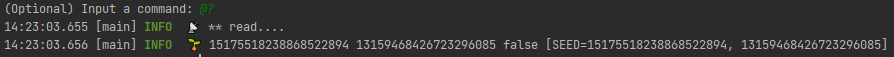

# Iv4XR-nethack

The aim of this project is to use the iv4XR agent to test [NetHack](https://nethack.org) and quantify testability using f.e. achieved coverage.
A socket connection is required since [NLE](https://github.com/facebookresearch/nle) (which contains NetHack) and [iv4XR](https://github.com/iv4xr-project/aplib) are programmed in different languages, Python and Java respectively. A socket connection is established between the Python (server) and Java (client) using custom messages in binary.

More details on server and client are mentioned in their README.md files.

* [Server README](./server-python/README.md)
* [Client README](./client-java/README.md)

This is for a Thesis project at Utrecht University.

## Configuring the game

The game has [configurations](./client-java/config.properties) that specify information about the socket connection, seed, and other general information.

## Playing the game

After starting the client and server as specified in their READMEs the following should be shown:

If the agent entrypoint is used, the map of the agentstate and the HPA\* representation is shown:

To have an overview of the possible commands type the command '?':

An example of a custom command is getting the seed:

